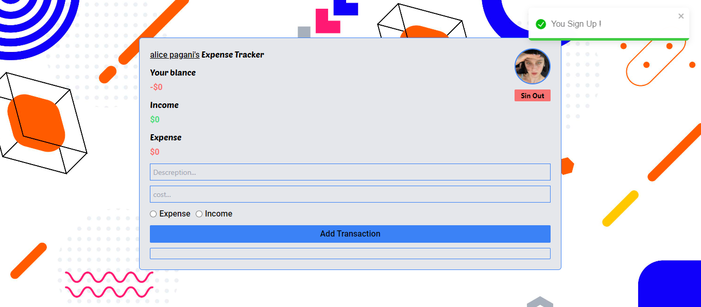

# Expense Tracker Application

## Description
This project is an expense tracker application built with React and Firebase. The application allows users to sign up, sign in, add transactions (income and expenses), and view their balance, total income, and total expenses. Users can also sign in using Google.

## Project Structure
The project consists of several components organized as follows:

```
src/
├── components/
│ ├── Auth.js
│ ├── page/
│ │ └── Main.js
│ ├── AddTransaction.js
│ ├── Tracker.js
│ ├── Transaction.js
│ └── User.js
├── asset/
│ ├── 18776140_6030756.jpg
│ └── avatar.png
├── config/
│ └── config.js
├── Context.js
└── App.js
```

## Screenshot





## Dependencies
- React
- Firebase
- react-toastify
- react-icons
- Tailwind CSS

## Installation
1. Clone the repository:
   ```bash
   git clone https://github.com/your-username/expense-tracker.git
   cd expense-tracker

2. Install dependencies:
    ```bash
    npm install

3. Set up environment variables:
    -Create a .env file in the root directory.
    -Add your Spoonacular API key to the .env file
    ```bash
    REACT_APP_FIREBASE_API_KEY=your_api_key
    REACT_APP_FIREBASE_AUTH_DOMAIN=your_auth_domain
    REACT_APP_FIREBASE_PROJECT_ID=your_project_id
    REACT_APP_FIREBASE_STORAGE_BUCKET=your_storage_bucket
    REACT_APP_FIREBASE_MESSAGING_SENDER_ID=your_messaging_sender_id
    REACT_APP_FIREBASE_APP_ID=your_app_id

4. Start the development server:
    ```bash
    npm start
5. Open your browser and visit http://localhost:3000 to view the Expense Tracker app.

## Usage
- Sign Up: Users can sign up with an email and password, and upload an avatar.
- Sign In: Users can sign in with their email and password or use Google sign-in.
- Add Transaction: Users can add income or expense transactions with descriptions and amounts.
- View Balance: Users can view their current balance, total income, and total expenses.

## Components
- App.js: Main component that handles authentication and renders either Auth or Main based on the user's authentication state.
- Auth.js: Handles user authentication (sign up, sign in, Google sign-in).
- Main.js: Main dashboard that includes Tracker, User, AddTransaction, and Transaction components.
- AddTransaction.js: Form for adding new transactions.
- Tracker.js: Displays the user's balance, total income, and total expenses.
- Transaction.js: Lists all transactions with descriptions, amounts, and types (income or expense).

## Custom Styles
- The project uses Tailwind CSS for styling with additional custom styles in the index.css file.

## Credits

This project was created by [0uali-Yassine].